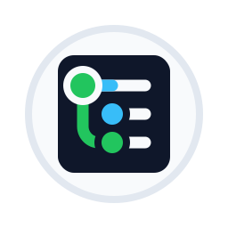
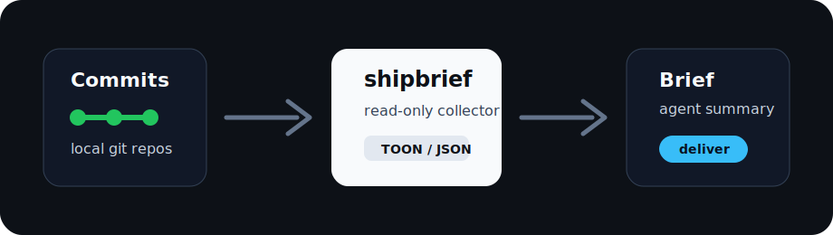

<p align="center">
  
</p>

<h1 align="center">shipbrief</h1>

<p align="center">
  <b>Daily commit briefings for people who code with agents.</b>
</p>

<p align="center">
  Turn a day of local git commits into a short, readable follow-up for Telegram, Slack, email, or any delivery provider you wire in.
</p>

<p align="center">
  <a href="https://www.npmjs.com/package/shipbrief"></a>
  <a href="https://github.com/beautyfree/shipbrief/actions"></a>
  <a href="./LICENSE"></a>
</p>

---

## Why

AI agents can write code all day. Humans still need a clean answer to one question:

> What shipped today?

`shipbrief` scans your local git projects, collects commits, emits compact agent-friendly TOON, lets your agent turn that data into a human summary, then delivers the final brief through a provider.

No repo crawling by the agent. No giant context dump. No manual end-of-day archaeology.

## Demo Flow

<p align="center">
  
</p>

1. You and your agents commit work during the day.
2. Evening automation runs `shipbrief run --today`.
3. Codex, Claude Code, Cursor, OpenCode, or another agent writes a readable brief.
4. `shipbrief deliver` sends it to Telegram today; Slack, email, and webhook providers fit the same pipeline.

Telegram output is compact: project name, expandable quote, human bullets, linked commit hashes.

```html
<b>shipbrief</b>
<blockquote expandable>
- Published npm package and switched automation to pinned npx launch (<a href="https://github.com/beautyfree/shipbrief/commit/dfc2035">dfc2035</a>)
- Fixed CI install and portable test glob (<a href="https://github.com/beautyfree/shipbrief/commit/e04659a">e04659a</a>, <a href="https://github.com/beautyfree/shipbrief/commit/22a8354">22a8354</a>)
</blockquote>
```

## Install

Requirements: Node.js 20+ and git. Works on macOS, Linux, and Windows.

Run without installing:

```bash
npx -y -p shipbrief shipbrief run --today
```

Install globally:

```bash
npm install -g shipbrief
shipbrief init
shipbrief doctor
```

Default config lives at `~/.shipbrief/config.json`:

```json
{
  "roots": ["~/Projects"],
  "outputDir": "~/shipbrief-reports"
}
```

## Daily Automation

Use this shape in your agent scheduler:

```bash
npx -y -p shipbrief shipbrief run --today
```

Prompt your agent:

```text
Read shipbrief TOON output. Write a concise human follow-up in my language.
Group by project. Use provider-safe HTML. Keep commit hashes as links.
Save report.html, then run:
npx -y -p shipbrief shipbrief check --html report.html
npx -y -p shipbrief shipbrief deliver --provider telegram --html report.html
```

Ready-to-copy templates:

- [Codex automation prompt](./templates/codex-automation.md)
- [AGENTS.md commit rules](./templates/AGENTS.md)
- [CLAUDE.md commit rules](./templates/CLAUDE.md)
- [Shipbrief agent skill](./skills/shipbrief/SKILL.md)

## Telegram Topic Setup

Create a Telegram bot with BotFather, add it to your group, then set:

```bash
export TELEGRAM_BOT_TOKEN="123:abc"
export TELEGRAM_COMMIT_REPORT_CHAT_ID="-1001234567890"
export TELEGRAM_COMMIT_REPORT_THREAD_ID="87"
```

On macOS GUI automations, persist env vars:

```bash
launchctl setenv TELEGRAM_BOT_TOKEN "123:abc"
launchctl setenv TELEGRAM_COMMIT_REPORT_CHAT_ID "-1001234567890"
launchctl setenv TELEGRAM_COMMIT_REPORT_THREAD_ID "87"
```

Then:

```bash
shipbrief check --html report.html
shipbrief deliver --provider telegram --html report.html
```

## Commands

```bash
shipbrief run --today                 # TOON, best for agents
shipbrief run --yesterday
shipbrief run --date 2026-07-03
shipbrief run --today --format json
shipbrief run --today --format markdown

shipbrief collect --today --output commits.json
shipbrief render --input commits.json --output report.txt
shipbrief check --html report.html
shipbrief deliver --provider telegram --html report.html
```

## Safety

`shipbrief` is read-only. It runs `git rev-parse`, `git config`, and `git log`.

It never fetches, pulls, pushes, checks out, resets, edits files inside repositories, or scans outside configured roots.

## Provider Model

`shipbrief` separates data collection from delivery:

- collector: local git commits to TOON/JSON/Markdown
- agent: human summary in user's language
- provider: validation, chunking, escaping, sending

Current provider: Telegram.

Planned provider shape: Slack, email, webhook. Same report, different delivery adapter.

## More

- [Automation details](./docs/AUTOMATION.md)
- [Development notes](./docs/DEVELOPMENT.md)
